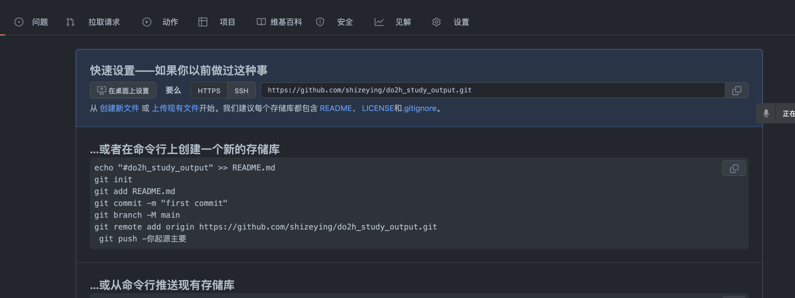

1. InputStream/outputStream 

   

   

2. stream 流 

3. 数组和集合区别

4. 异常有哪些

5. function函数

6. docker

7. mysql

8. 算法:学了哪些算法：这些算法有什么特性

9. restful API规范

10. 如何创建maven项目

11. 如何创建springboot项目并如何配置springboot项目

12. [springboot-study-mybatis-plus](..%2F..%2Fspringbootstudy%2Fspringboot-study-mybatis-plus)
    stream完成

- 以上有代码的地方需要贴出对应的代码